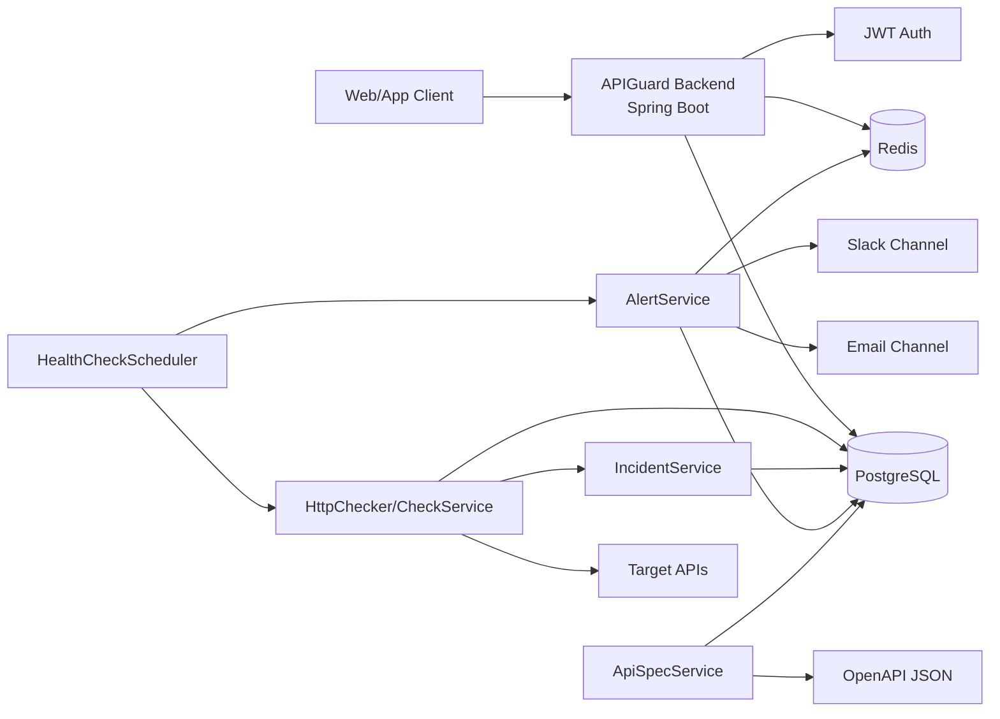
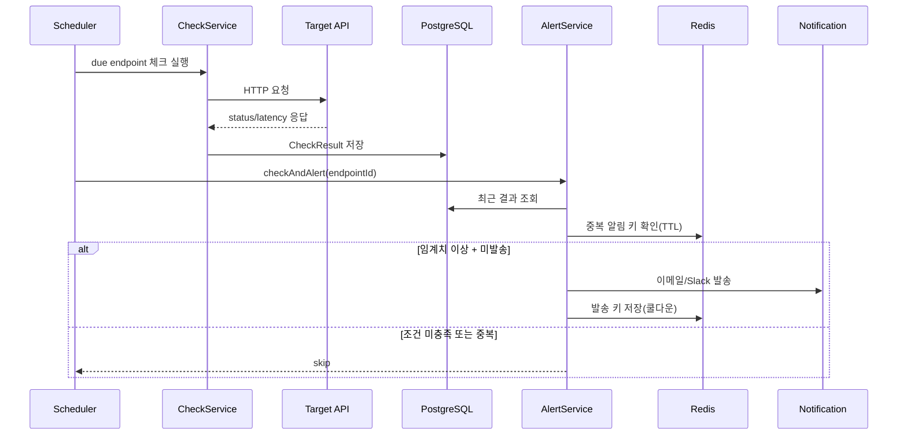

# APIGuard Backend

APIGuard는 외부 API 의존성이 있는 서비스 팀을 위한 **API Reliability & Contract Change Detection SaaS**입니다.

등록된 API Endpoint를 주기적으로 확인하고, HTTP 상태와 응답 시간을 기록합니다.
연속 실패가 발생하면 Incident를 생성하고, Redis 기반 cooldown으로 중복 알림을 방지합니다.
또한 OpenAPI snapshot을 저장한 뒤 이전 버전과 비교해 breaking change를 감지합니다.

## Problem

서비스는 점점 더 많은 외부 API에 의존합니다. 외부 API 장애, 응답 지연, 계약 변경은 내부 코드 변경 없이도 사용자 장애로 이어질 수 있습니다.

APIGuard는 외부 API 상태를 주기적으로 검사하고, 장애 이력과 OpenAPI 계약 변경 이력을 함께 관리하는 개발팀용 API Reliability SaaS입니다.

- 외부 API 장애를 늦게 알게 되는 문제
- 동일 장애에 대한 중복 알림 문제
- OpenAPI 스펙 변경으로 클라이언트가 깨지는 문제
- 팀/플랜 규모에 맞는 SaaS 운영 가드레일 부재

## Product Positioning

ApiGuard라는 이름은 API 운영 안정성을 지킨다는 의미입니다. 이 프로젝트는 취약점 스캐너, WAF, API Gateway가 아니라 **외부 API 장애와 breaking change를 조기에 감지하는 Reliability 도구**로 설계했습니다.

한 줄로 설명하면 다음과 같습니다.

> 외부 API 의존성이 있는 개발팀을 위한 API 장애·계약 변경 감지 SaaS

## 핵심 기능

- 워크스페이스 기반 멀티 프로젝트 관리
- 프로젝트별 엔드포인트 등록/수정/활성화 토글
- 스케줄러 기반 주기적 헬스체크 실행
- 응답 상태/성공률/시간대별 통계 제공
- 연속 실패 기반 Incident 생성 및 회복 시 resolved 처리
- 연속 실패 임계치 기반 알림 트리거
- Redis 쿨다운 기반 중복 알림 방지
- OpenAPI snapshot 저장 및 breaking change 감지
- JWT 인증/인가 및 공통 응답 포맷 표준화
- FREE/PRO 플랜별 기능 제한 정책 적용

## 동작 흐름

1. 사용자가 워크스페이스와 프로젝트를 생성하고 엔드포인트를 등록합니다.
2. 스케줄러가 활성 엔드포인트를 주기적으로 검사합니다.
3. 체크 결과가 누적되며, 통계 API로 가시화 가능한 지표가 만들어집니다.
4. 실패가 임계치를 넘으면 Incident를 생성하고 이메일/Slack 채널로 알림을 보냅니다.
5. 동일 알림은 Redis 쿨다운으로 중복 발송을 억제합니다.
6. OpenAPI 스펙 소스는 snapshot을 저장하고 이전 버전과 비교해 breaking change를 기록합니다.

## Key Scenarios

1. 외부 API Endpoint 등록
2. 스케줄러 기반 병렬 상태 체크
3. 연속 실패 발생 시 Incident 생성
4. Redis cooldown으로 중복 알림 방지
5. OpenAPI snapshot 비교
6. Breaking Change 감지 및 계약 변경 이력 관리

## 5분 데모 시나리오

로컬 데모는 운영 배포가 아니라 기능 검증 흐름에 초점을 둡니다.

1. 로컬 인프라를 실행합니다.

```bash
docker compose up -d db redis
```

2. 백엔드와 프론트엔드를 각각 실행하고 회원가입/로그인을 진행합니다.

```bash
./gradlew bootRun --args='--spring.profiles.active=dev'
```

3. 워크스페이스와 프로젝트를 만들고 실패 응답을 반환하는 엔드포인트를 등록합니다.

```text
URL: https://httpstat.us/500
Expected status: 200
Check interval: 60
```

4. 수동 체크를 3회 실행해 `AVAILABILITY` Incident가 생성되는지 확인합니다.
5. 알림 설정을 추가하고 동일 장애를 반복해 Redis cooldown이 중복 발송을 억제하는지 확인합니다.
6. OpenAPI demo fixture를 사용해 snapshot 저장 후 breaking change 감지를 확인합니다.

자세한 OpenAPI diff 재현 절차와 fixture는 `docs/openapi-breaking-change-demo.md`에 있습니다.

## 시각화

### 시스템 아키텍처



### 체크 및 알림 시퀀스



## 아키텍처 관점

- **Layered Domain Architecture**: `controller -> service -> repository` 계층을 기준으로 도메인 책임을 분리했습니다.
- **Stateful Data + Stateless Auth**: 데이터 일관성은 RDB(PostgreSQL)에서, 인증 상태는 JWT 기반 무상태 방식으로 처리합니다.
- **Async Check Execution**: 스케줄러는 체크 대상을 병렬 실행해 대량 엔드포인트에서도 처리량을 확보합니다.
- **Incident State Management**: 체크 결과와 장애 이력을 분리해 운영 관점의 open/resolved 상태를 관리합니다.
- **Alert Deduplication**: Redis TTL 키로 동일 알림의 재발송을 제한해 알림 폭주를 방지합니다.
- **Contract Change Detection**: OpenAPI snapshot을 저장하고 path/method 삭제, 필수 parameter/body 추가, response field 삭제/type 변경 같은 breaking change를 비교합니다.
- **Policy-Driven Subscription**: 플랜 제한은 정책 객체(`PlanLimitPolicy`)로 분리해 기능 확장 시 변경 범위를 최소화합니다.

## 도메인 구성

- `auth`: 로그인, 토큰 재발급, 로그아웃
- `user`: 회원가입, 내 정보 조회/수정, 비밀번호 변경, 탈퇴
- `workspace`: 워크스페이스/멤버/권한 관리
- `project`: 외부 API 의존성 묶음 관리
- `endpoint`: 검사 대상 URL/메서드/주기 관리
- `check`: 수동 테스트, 체크 히스토리, 통계
- `incident`: 연속 실패, 성능 저하, 계약 변경 Incident 이력 관리
- `alert`: 실패 기반 알림 정책 및 채널 관리
- `apispec`: OpenAPI snapshot, diff, breaking change 관리
- `subscription/payment`: 플랜 제약 및 결제 상태 관리

## 플랜 정책

| 항목 | FREE | PRO |
|---|---:|---:|
| 프로젝트당 엔드포인트 수 | 5 | 50 |
| 최소 체크 주기(초) | 300 | 60 |
| 엔드포인트당 알림 채널 수 | 1 | 제한 없음 |
| 워크스페이스 멤버 수 | 1 | 제한 없음 |
| 데이터 보관 기간(일) | 7 | 90 |

## 기술 스택

- Java 21
- Spring Boot, Spring Security, Spring Data JPA
- PostgreSQL, Redis
- JWT (`jjwt`)
- OpenAPI/Swagger (`springdoc`)
- Gradle

## 서버 배포

- 앱 포트: `8080`
- 실행 프로파일: `prod`
- 헬스체크: `GET /health`
- 필수 인프라: PostgreSQL, Redis

### 운영 환경변수

- `SPRING_PROFILES_ACTIVE=prod`
- `DB_URL`
- `DB_USERNAME`
- `DB_PASSWORD`
- `REDIS_HOST`
- `REDIS_PORT`
- `JWT_SECRET`
- `MAIL_HOST`
- `MAIL_PORT`
- `MAIL_USERNAME`
- `MAIL_PASSWORD`
- `TOSS_SECRET_KEY`
- `TOSS_CLIENT_KEY`

### Docker Compose 실행

1. `.env.example`을 복사해 `.env`를 만들고 운영 값을 채웁니다.
2. 서버에서 아래 명령으로 전체 스택을 실행합니다.

```bash
docker compose -f docker-compose.server.yml up -d --build
```

### 배포 파일

- `Dockerfile`: Spring Boot 애플리케이션 이미지 빌드
- `Dockerfile.deploy`: 배포용 JAR를 컨테이너 이미지로 패키징
- `docker-compose.server.yml`: 앱 + PostgreSQL + Redis 운영 배포 구성
- `.env.example`: 운영 환경변수 예시

## GitHub Actions

### PR CI

- `.github/workflows/pr-ci.yml`
- `main` 대상으로 PR이 열리거나 갱신되면 실행됩니다.
- 테스트는 H2 인메모리 DB를 사용하므로 별도 PostgreSQL/Redis 서비스 없이 `./gradlew test bootJar --no-daemon`을 수행합니다.

### Main Deploy

- `.github/workflows/deploy.yml`
- `main` 브랜치에 push 되면 실행됩니다.
- `bootJar`로 JAR를 빌드한 뒤 배포 번들을 SSH/SCP로 서버에 전송하고, `docker compose up -d --build`로 운영 스택을 갱신합니다.

### GitHub Secrets

- `DEPLOY_HOST`: 배포 대상 서버 호스트
- `DEPLOY_USER`: 서버 접속 계정
- `DEPLOY_SSH_KEY`: 서버 접속용 private key

### GitHub Variables

- `DEPLOY_PORT`: SSH 포트, 기본값 `22`
- `DEPLOY_PATH`: 배포 번들 업로드 및 Compose 실행 경로, 기본값 `/home/<DEPLOY_USER>/apps/apiguard`

### 서버 전제 조건

- 대상 서버에 Docker Engine과 Docker Compose가 설치되어 있어야 합니다.
- 서버의 `DEPLOY_PATH` 경로에 운영용 `.env` 파일이 준비되어 있어야 합니다.
- 배포 계정은 `DEPLOY_PATH`에 쓰기 가능해야 합니다.
- 배포 계정은 `docker compose`를 실행할 수 있어야 합니다.

## API 설계 원칙

- JWT Bearer 기반 인증
- 일관된 공통 응답 스키마 `ApiResponse<T>`
- 도메인 예외를 전역 핸들러에서 표준 오류 형태로 변환
- 화이트리스트 기반 공개 엔드포인트 최소화

## 신뢰성 및 운영 고려사항

- **체크 정확성**: 엔드포인트별 `checkInterval`과 `lastCheckedAt` 기반으로 점검 시점을 계산합니다.
- **알림 신호 품질**: 단일 실패가 아닌 연속 실패 임계치로 알림을 트리거해 오탐을 줄입니다.
- **계약 안정성**: OpenAPI snapshot을 비교해 API가 살아 있어도 클라이언트를 깨뜨릴 수 있는 breaking change를 별도 이력으로 남깁니다.
- **보안 기본값**: CSRF/세션 기반 인증을 비활성화하고, 인증 필터 체인을 JWT 중심으로 구성합니다.
- **확장 여지**: 알림 채널은 `NotificationService` 구현 추가로 확장 가능합니다.
- **관측 가능성**: 헬스체크 시작/완료 및 실패 로그를 남겨 운영 중 추적 가능성을 확보합니다.

## 프로젝트 철학

이 프로젝트는 "헬스체크 도구"를 넘어서, 외부 API 장애와 계약 변경을 개발팀이 운영 가능한 데이터로 관리하는 것을 목표로 합니다.

## 문서

- 상세 API 명세: `API_SPEC.md`
- 개발 로드맵: `docs/APIGuard_Development_Roadmap.md`
- OpenAPI breaking change demo: `docs/openapi-breaking-change-demo.md`
- Public release checklist: `docs/public-release-checklist.md`
